# NANOMATERIALS_PROPERTY

Machine learning for the **mechanical properties of 2D (van der Waals) materials**, with one emphasis: *honest evaluation*. Do the models still work on materials unlike the ones they were trained on?
Everything below (data, features, models, formulas, scores and plots) is generated from files in [`mat-ml/`](mat-ml/). Technical details: [`mat-ml/README.md`](mat-ml/README.md), [`methods_and_models.md`](mat-ml/docs/methods_and_models.md).

**Contents**
1. [What was done](#1-what-was-done) · 2. [Data and preprocessing](#2-data-and-preprocessing) · 3. [Features and targets](#3-features-and-targets) · 4. [Feature selection](#4-feature-selection-methods) · 5. [Models](#5-models)
6. [Evaluation design](#6-evaluation-design) · 7. [Metrics and formulas](#7-metrics-and-formulas) · 8. [Results: Task A](#8-results-task-a-monolayer-stiffness) · 9. [Results: Task B](#9-results-task-b-bilayer-interlayer-labels)
10. [ML-potential validation](#10-ml-potential-validation) · 11. [Limitations](#11-limitations-and-what-is-not-established) · 12. [Reproduce](#12-reproduce) · 13. [Data sources and licence](#13-data-sources-and-licence)

## 1. What was done
| Part | Question | Data | Main model |
|---|---|---|---|
| **Task A** | Predict a monolayer's 2D Young's modulus (N/m) and Poisson ratio from composition and geometry | C2DB, 7,258 mechanically stable monolayers; external check on 186 JARVIS materials | LightGBM (also Ridge, random forest) |
| **Task B** | Predict a bilayer's interlayer binding energy and gap from *monolayer* information (incl. C2DB stiffness through a uid map) | BiDB, 10,192 homobilayers of 992 monolayers | LightGBM |
| **ML-potential validation** | Can a universal ML interatomic potential (MACE-MP-0, MACE-MPA-0, CHGNet) supply reliable stiffness and binding labels? | C2DB, JARVIS, BiDB references | (not learned here; checked against DFT) |

**Headline findings**
- Random cross-validation overestimates accuracy, and the cause is **structure-level overlap**: LightGBM Y2D MAE is 13.8 N/m under random CV and 19.9 N/m when whole structure families are held out (MAE ratio 1.44; 95% CI 1.30–1.62 when whole families are resampled, see Phase C below). Holding out chemical systems changes nothing (ratio 1.01, CI 0.99–1.04).
- For bilayer binding energy the inflation is larger: MAE 2.4 (random) vs 9.1 (new monolayers) vs 13.6 meV/Ų (new families), against 18.5 for the mean predictor.
- On 186 JARVIS materials the ranking transfers (Spearman 0.82, 95% CI 0.72–0.90); for the 55 with chemistries absent from training, MAE is 29 N/m (95% CI 20–40).
- MACE-MPA-0 reproduces BiDB binding-energy ranking and magnitude (Spearman 0.90, median ratio 1.10) but **fails the interlayer-gap criterion**; bilayer in-plane stiffness is consistent with additive layers in that model (median ratio 2.008, CI [1.95, 2.03]; not DFT-validated).

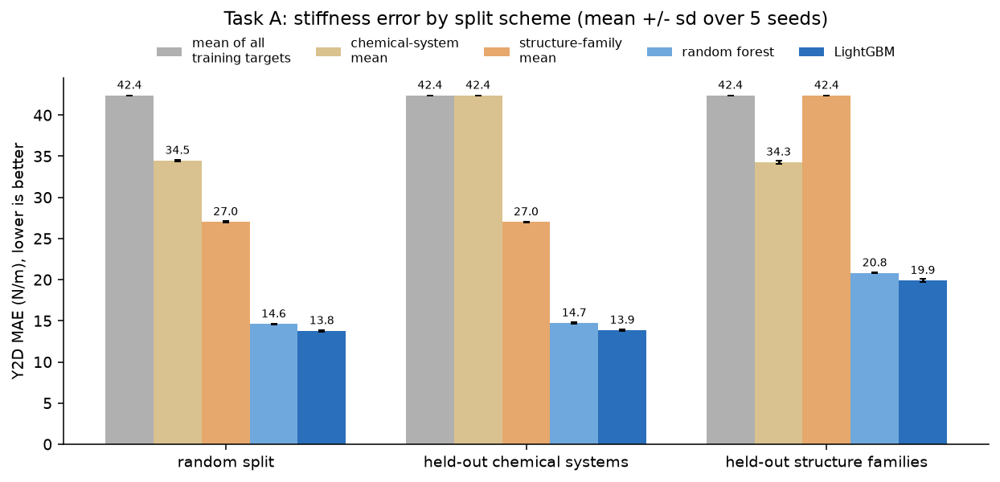
*Figure 1. Y2D error by split scheme. Grey/tan/orange bars are feature-free baselines (the mean of the training targets; the mean within the same chemical system or structure family). Note that the family-mean baseline looks good under random splits (27.0) and is no better than the global mean for unseen families (42.4): this is what the family overlap buys.*

## 2. Data and preprocessing
**Sources.** C2DB (GPAW/PBE; stiffness tensors) · JARVIS-DFT 2D (VASP/OptB88vdW) · BiDB (PBE-D3 bilayers, Pakdel et al. 2024). Raw files are not in the repository (links in section 13).

| Step | Rule | Result |
|---|---|---|
| C2DB: materials with a stiffness file | read the per-material JSON tree (32 files use an older flat layout and are handled) | 8,462 of 16,905 |
| Finite tensor | C11, C12, C22 finite | 8,462 |
| **Mechanical stability** | symmetrised 3×3 (xx, yy, xy) tensor positive definite (computed from the tensor, never from database labels) | 7,474 |
| Symmetry quality | max\|C − Cᵀ\| / max\|C\| ≤ 10% | 7,258 |
| Positive stiffness | Y2D > 0 | **7,258** (3,806 chemical systems, 676 families) |
| Poisson task | \|ν\| ≤ 1 | 7,229 |
| JARVIS | 229 elastic tensors; corrupt ones (NaN / denormal values) removed; xx–yy block must satisfy C11, C22 > 0 and C11·C22 − C12² > 0; the shear entries are not used (they do not reproduce (C11 − C12)/2 for MoS2) | **186 usable** |
| BiDB validity (Task B) | target > 0 and ≤ upper log-IQR bound (Q3 + 3·IQR of log10 target) | binding energy 9,993 · gap 10,189 |
| Missing values | median imputation fitted inside each training fold; Magpie's own NaN imputation | – |
| Duplicates | polymorphs are kept as separate rows (no deduplication) | – |

**Sample-selection methods (for the ML-potential checks; all by fixed seed, none using model results).**
| Set | How selected |
|---|---|
| Stiffness benchmark | pool: non-magnetic, energy above hull ≤ 0.1 eV/atom, ≤ 12 atoms (3,380 monolayers, 395 families); draw 150 families at random, one random member each; plus all 186 JARVIS materials |
| JARVIS interlayer reference set | 40 random non-magnetic monolayers with ≤ 10 atoms from a pool of 485 that have an exfoliation energy |
| BiDB validation set | 30 random non-magnetic monolayers (≤ 6 atoms, ≥ 5 valid stackings) from 389 eligible; all 307 of their bilayers |

## 3. Features and targets
**Task A: 141 features, composition and geometry only.**
| Group | # | How computed |
|---|---|---|
| Magpie composition | 132 | matminer `ElementProperty` (Magpie preset) on the reduced formula: 22 elemental properties × 6 statistics (minimum, maximum, range, mean, average deviation, mode) |
| Lattice | 3 | in-plane lengths a, b and angle γ |
| Atom density | 2 | area per atom (Ų), number of atoms |
| Thickness | 1 | cell height minus the largest periodic gap between atomic planes (matches C2DB's own thickness, correlation 1.00) |
| Layer count | 1 | constant 1 (carries no information; kept) |
| Symmetry | 1 | space-group number |
| Chemistry | 1 | number of elements |
| *Excluded on purpose* | – | DFT outputs (hull energy, formation energy, stability labels, band gap) because they are unavailable for a new material |

**Task B: three nested feature sets.** `mono_basic` (140): Magpie + monolayer geometry + layer group. `mono_stiffness` (147, primary): + C2DB stiffness through the uid map (ln Y2D, ln C11, ln C22, C12, shear, Poisson ratio, indicator; 977 of 992 monolayers have a clean tensor). `mono_stiffness_stacking` (158, extension): + stacking descriptors decoded from the bilayer uid (rotation matrix, z-flip, sin/cos of the in-plane shifts, bilayer layer group and inversion symmetry). `slide_stability` was excluded because it is derived from the energy landscape (label leakage).

**Targets**
| Task | Target | Definition | Unit | Fitted on |
|---|---|---|---|---|
| A | Y2D | (C11·C22 − C12²) / C22 | N/m | ln scale |
| A | Poisson ratio | C12 / C22 | – | raw |
| B | binding energy | −(E_bilayer − 2·E_monolayer) / A × 1000, per interface, positive = bound | meV/Ų | ln scale |
| B | interlayer gap | min z(top layer) − max z(bottom layer) | Å | ln scale |

## 4. Feature selection methods
| Method | Used? | Detail |
|---|---|---|
| Manual exclusion (availability / leakage) | **yes** | DFT outputs and `slide_stability` removed |
| Feature-**group ablation** | **yes** | composition only, geometry only, space group only, all minus space group, + layer group, + anonymous formula, + both (Figure 2) |
| Filter methods (variance, correlation, mutual information) | no | all columns kept, including the constant layer-count column |
| Wrapper methods (RFE, forward/backward) | no | – |
| Embedded L1 selection (LASSO) | no | Ridge is L2: it shrinks but does not select |
| Feature-importance analysis (SHAP, permutation) | no | statements about "what carries signal" rest on the ablations only |
| Rare-category collapsing | yes | one-hot categories with < 10 rows merged into `other` (counts only, no labels) |

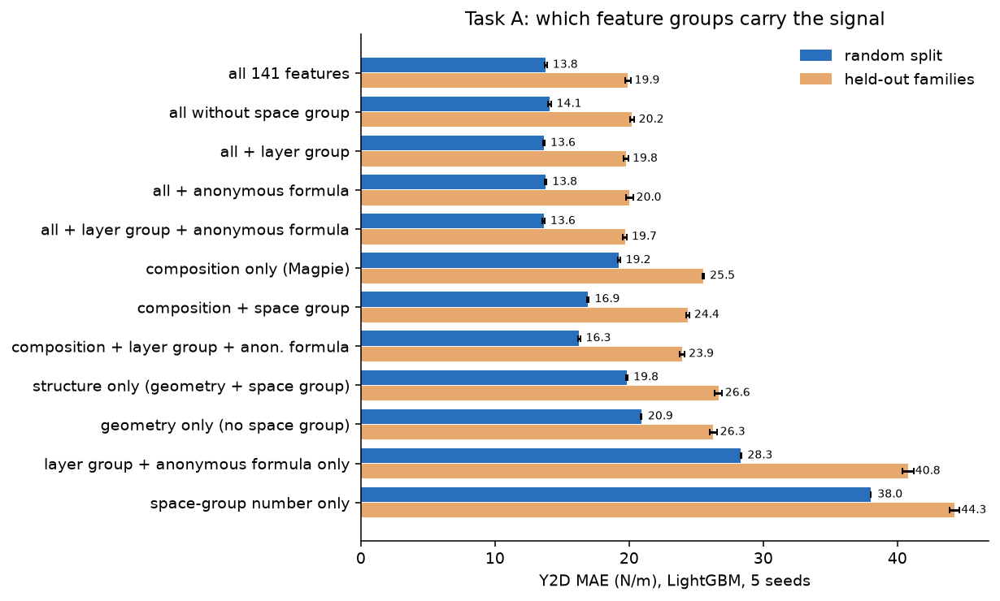
*Figure 2. Feature-group ablation (LightGBM, 5 seeds). Composition and geometry each give about 19–20 N/m; together 13.8. The space-group number alone is nearly useless, and adding layer group or anonymous formula changes the full model by at most about 1%: the family gap is not a missing-descriptor problem.*

## 5. Models
| Model | Preprocessing | Hyper-parameters (fixed; no search) | Role |
|---|---|---|---|
| Ridge | median imputer → StandardScaler | RidgeCV, α = 10⁻³ … 10³ (13 log-spaced) | linear baseline |
| Random forest | median imputer | 300 trees, `max_features` = 0.33 | non-linear baseline |
| **LightGBM** | median imputer | 500 trees, learning rate 0.05, 31 leaves, row subsample 0.8, column subsample 0.5 | **primary model** |
| Mean predictor | – | training mean (arithmetic; geometric also run) | baseline |
| Family-mean / chemical-system-mean | – | mean of ln Y2D within the training group; unseen groups fall back to the global mean | diagnostic baselines |

LightGBM was chosen because it had the lowest error in every Task A split and trains in seconds; in Task B it is within about 0.5 meV/Ų of the random forest. Not tried: graph neural networks, hyper-parameter search. Final models are saved in [`mat-ml/models/`](mat-ml/models/) with model cards.

## 6. Evaluation design
- **5-fold cross-validation**; seed 42 for the full grids and seeds 42–46 for the robustness runs. No hyper-parameters were tuned, so no validation split was needed; there is no separate held-out test set. Generalisation is measured by grouped CV and an external set (JARVIS).
- **Splits:** random · cluster-stratified (K-means, 20 clusters, Task A) · grouped by chemical system (A) · grouped by structure family (A, B) · grouped by monolayer (B). Grouped folds use `StratifiedGroupKFold` on ten target quantile bins (target balance only; groups stay disjoint).
- **Leakage statistic:** the share of test materials whose chemical system, formula, family or monolayer also occurs in training (Figure 3). Unit tests check that grouped folds never share groups.

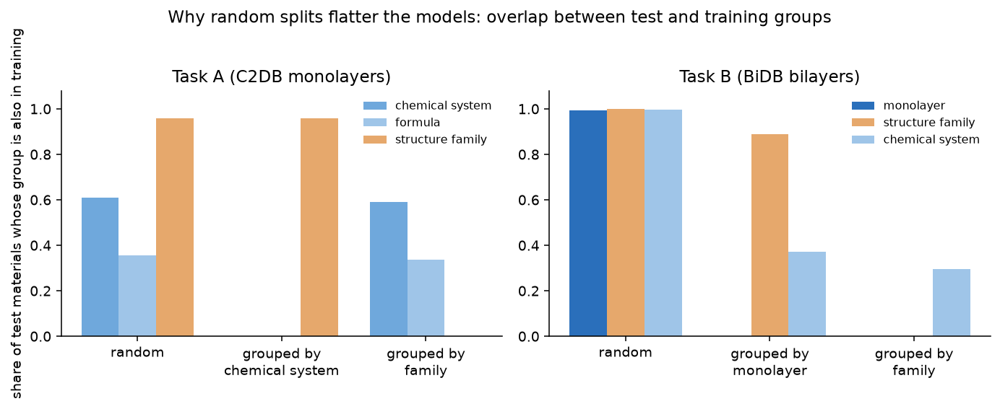
*Figure 3. Random splits leak: 61% of Task A test materials share their chemical system with training (96% share their family), and 99.3% of Task B test bilayers have their monolayer in training.*

## 7. Metrics and formulas
With $y$ = reference, $\hat y$ = prediction, $n$ = number of test materials:

- **MAE** $=\dfrac{1}{n}\sum_i\lvert\hat y_i-y_i\rvert$  (original units)
- **RMSE** $=\sqrt{\dfrac{1}{n}\sum_i(\hat y_i-y_i)^2}$
- **R²** $=1-\dfrac{\sum_i(y_i-\hat y_i)^2}{\sum_i(y_i-\bar y)^2}$ (negative = worse than the mean predictor); **ln R²** is the same formula on $\ln y$ and $\ln\hat y$ (stable under extrapolation)
- **Spearman ρ**: rank correlation of $\hat y$ and $y$ (ranking quality)
- **Slope through the origin** $=\dfrac{\sum\hat y_i y_i}{\sum y_i^2}$ (0.89 means predictions about 11% too small) · **median ratio** $=\operatorname{median}(\hat y_i/y_i)$ · **bias** $=\overline{\hat y-y}$
- **Grouped / random ratio** $=\mathrm{MAE}_{\text{grouped}}/\mathrm{MAE}_{\text{random}}$ · **error reduction** $=1-\mathrm{MAE}/\mathrm{MAE}_{\text{mean predictor}}$
- **Between-monolayer share (Task B ceiling)** $=1-\dfrac{\sum(\ln y-\overline{\ln y}_{\text{monolayer}})^2}{\sum(\ln y-\overline{\ln y})^2}$: the most a monolayer-only model can reach (0.955 for binding energy, 0.771 for the gap)
- **Uncertainty:** standard deviation over folds (with min–max), over seeds, bootstrap 95% intervals over JARVIS rows, and cluster bootstrap over monolayers where stackings are not independent.

Physics formulas used above: $Y_{2D}=\dfrac{C_{11}C_{22}-C_{12}^2}{C_{22}}$, $\nu=\dfrac{C_{12}}{C_{22}}$, stability $\lambda_{\min}\!\big(\tfrac12(C+C^{T})\big)>0$, $\;E_b=-\dfrac{E_{\text{bilayer}}-2E_{\text{mono}}}{A}\times1000$ (meV/Ų);
for ML-potential stiffness $C\,[\mathrm{N/m}]=\dfrac{\partial\sigma}{\partial\varepsilon}\,L_z\times16.0218$ with $\sigma$ in eV/ų and $L_z$ the cell height; JARVIS exfoliation reference $E_b^{\text{ref}}=\text{exf}[\text{meV/atom}]\times n_{\text{atoms}}/A$.

## 8. Results: Task A (monolayer stiffness)
**Y2D, seed 42, 5-fold** (MAE ± std over folds; units N/m)
| Split | Model | MAE | RMSE | R² | ln R² |
|---|---|---|---|---|---|
| random | Ridge | 22.51 ± 0.75 | 37.99 | 0.686 | 0.635 |
| random | Random forest | 14.67 ± 0.38 | 26.26 | 0.849 | 0.784 |
| random | **LightGBM** | **13.74 ± 0.25** | 24.06 | 0.873 | 0.802 |
| chemical system | Random forest | 14.82 ± 0.59 | 27.55 | 0.834 | 0.787 |
| chemical system | **LightGBM** | **13.91 ± 0.57** | 24.91 | 0.864 | 0.807 |
| family | Ridge | 31.12 ± 14.19 | 124.77 | −11.02 | 0.554 |
| family | Random forest | 20.88 ± 2.52 | 36.42 | 0.670 | 0.669 |
| family | **LightGBM** | **19.82 ± 2.78** | 34.07 | 0.703 | 0.681 |

(The Ridge family R² of −11 comes from one fold whose ln-space extrapolation blew up after exponentiation; its ln R² is 0.554.) **Five seeds, LightGBM:** MAE 13.80 ± 0.11 (random), 13.86 ± 0.07 (chemical system), 19.90 ± 0.22 (family); family/random ratio 1.44 ± 0.02 over seeds (but **95% CI 1.30–1.62 when families are resampled**; the seed spread understates the uncertainty), chemical-system/random 1.00 ± 0.01 over seeds (CI 0.99–1.04). Baselines: mean of targets 42.4 N/m; family mean 27.0 (random split).

**Poisson ratio** (seed 42; MAE / R²): LightGBM 0.111 / 0.394 (random), 0.109 / 0.417 (chemical system), 0.140 / 0.139 (family); random forest 0.107 / 0.412, 0.105 / 0.440, 0.140 / 0.142; Ridge 0.144 / 0.109, 0.144 / 0.110, 0.152 / 0.034.

**External check on JARVIS** (train on all of C2DB; 95% bootstrap intervals over JARVIS rows)
| Features / model | Subset (n) | MAE (N/m) | ln R² | Spearman |
|---|---|---|---|---|
| LightGBM, all | all (186) | 19.0 [14.4, 24.5] | 0.55 [0.34, 0.73] | 0.82 [0.72, 0.90] |
| LightGBM, all | unseen chemistry (55) | 29.1 [20.5, 39.6] | 0.45 [−0.14, 0.75] | 0.73 [0.51, 0.89] |
| LightGBM, composition only | unseen chemistry (55) | 37.5 [27.5, 49.0] | 0.06 [−0.65, 0.43] | 0.56 [0.29, 0.75] |
| LightGBM, structure only | unseen chemistry (55) | 32.6 [21.8, 45.4] | 0.41 [−0.06, 0.67] | 0.64 [0.42, 0.83] |
| Random forest, all | unseen chemistry (55) | 35.2 [26.0, 47.1] | 0.27 [−0.48, 0.62] | 0.69 [0.45, 0.86] |

C2DB and JARVIS differ by 8.6 N/m MAE even on the *same* 106 materials, a floor that is not model error.

### Out-of-fold diagnostics (every point predicted by a model that never saw its material or group)
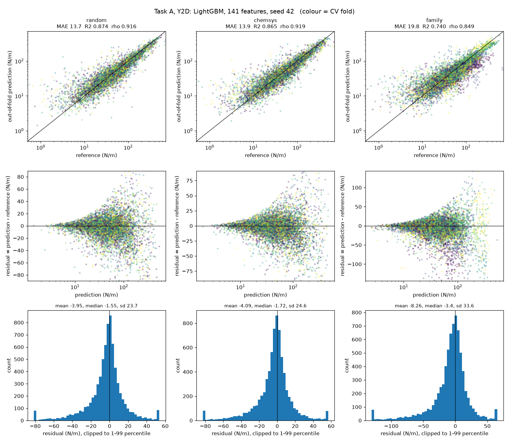
*Figure 4. Y2D (LightGBM, seed 42): parity (top), residual vs prediction (middle), residual histogram (bottom); colour = CV fold. Residuals grow with stiffness and the stiffest materials are under-predicted (mean residual −4 N/m, −8 N/m for unseen families). Panel titles show pooled metrics; the tables show fold means (R² differs slightly for that reason, MAE does not). The recomputed fold MAEs reproduce the tables to 3.6 × 10⁻¹⁵.*

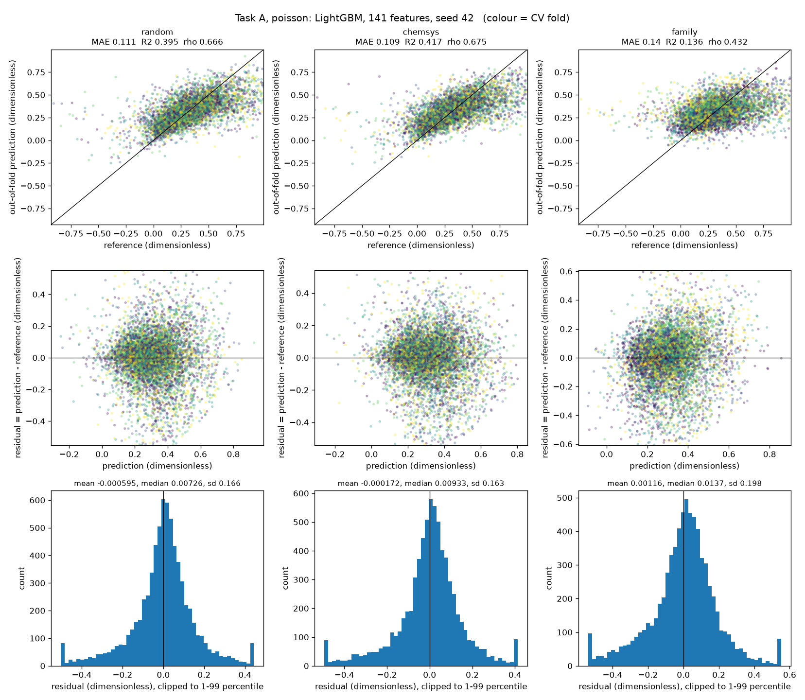
*Figure 5. Poisson ratio: weakly predictable (R² ≈ 0.4 for random splits, ≈ 0.14 for unseen families).*

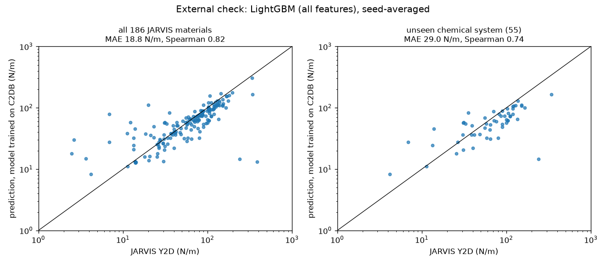
*Figure 6. External check: model trained on C2DB, predicting JARVIS stiffness (left: all 186; right: the 55 with unseen chemical systems).*

## 9. Results: Task B (bilayer interlayer labels)
**LightGBM on `mono_stiffness`, 5 seeds** (binding energy in meV/Ų, gap in Å; mean predictor in the last column)
| Target | Split | MAE (seed sd) | RMSE (seed 42) | R² | ln R² | Spearman | Mean predictor MAE | Error reduction |
|---|---|---|---|---|---|---|---|---|
| binding energy | random | **2.42** (0.01) | 4.02 | 0.985 | 0.940 | 0.944 | 18.51 | 87% |
| binding energy | new monolayers | **9.07** (0.42) | 24.64 | 0.483 | 0.643 | 0.833 | 18.51 | 51% |
| binding energy | new families | **13.59** (0.30) | 29.97 | 0.200 | 0.351 | 0.707 | 18.54 | 27% |
| gap | random | **0.248** (0.001) | 0.322 | 0.660 | 0.688 | 0.764 | 0.415 | 40% |
| gap | new monolayers | **0.278** (0.005) | 0.360 | 0.513 | 0.398 | 0.751 | 0.415 | 33% |
| gap | new families | **0.316** (0.002) | 0.434 | 0.391 | 0.310 | 0.684 | 0.415 | 24% |

- **Random CV is not a meaningful estimate here.** Each monolayer appears about ten times with identical monolayer features, so a random split lets the model recognise the monolayer: the random ln R² (0.94) equals the between-monolayer ceiling (0.955). Grouped MAE is 3.7× (monolayers) and 5.6× (families) the random MAE for binding energy.
- **C2DB stiffness gives no detectable benefit** (MAE with vs without it differs by ≤ 0.05 meV/Ų and ≤ 0.001 Å, within seed noise). **Stacking descriptors** (extension, seed 42) help the gap a lot (family-split MAE 0.32 → 0.27 Å) and binding energy only a little.
- **Outlier rule matters:** without filtering, extreme z-scan values (up to 7,970 meV/Ų) dominate (mean-predictor MAE 34.4). The gap results also depend on whether gaps below 1.49 Šare removed.

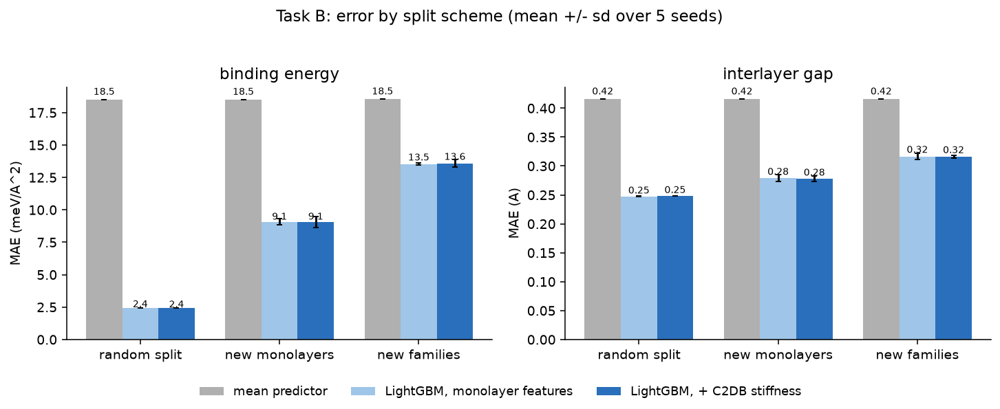
*Figure 7. Task B error by split scheme, 5 seeds, with and without C2DB stiffness.*

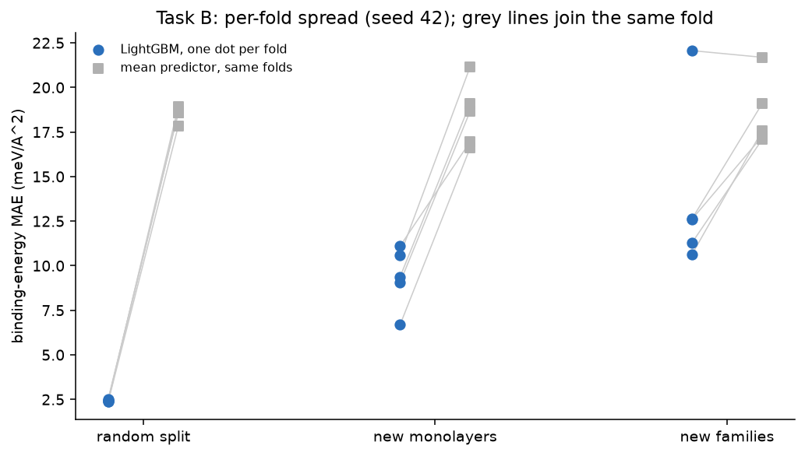
*Figure 8. Per-fold spread (seed 42). Under the family split the folds range from 10.6 to 22.1 meV/Ų, and one fold (22.06) is worse than the mean predictor (21.69).*

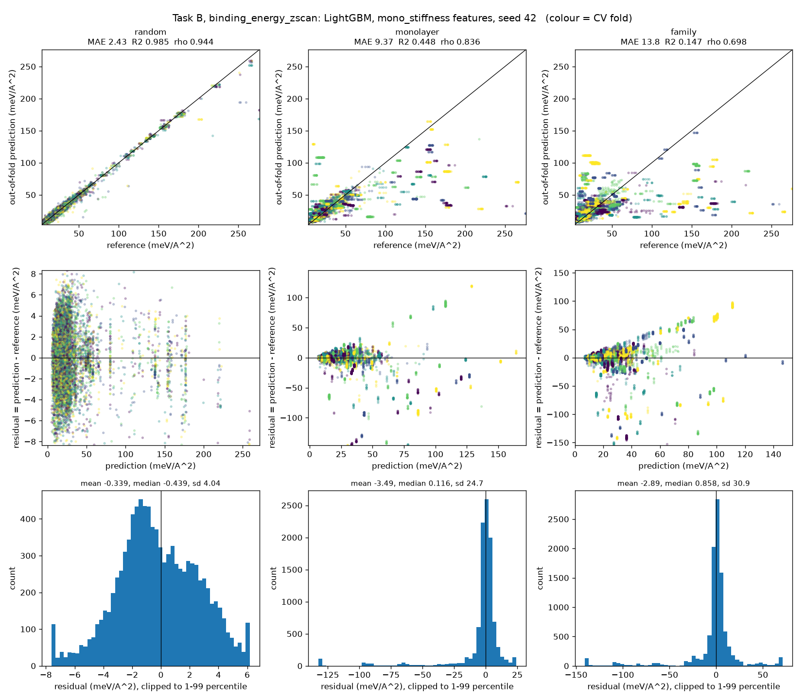
*Figure 9. Binding-energy parity and residuals. The horizontal streaks in the grouped panels are monolayer-level predictions (all stackings of a monolayer get one value); residuals are heavy-tailed (median ≈ 0, a minority missed by 50–130 meV/Ų).*

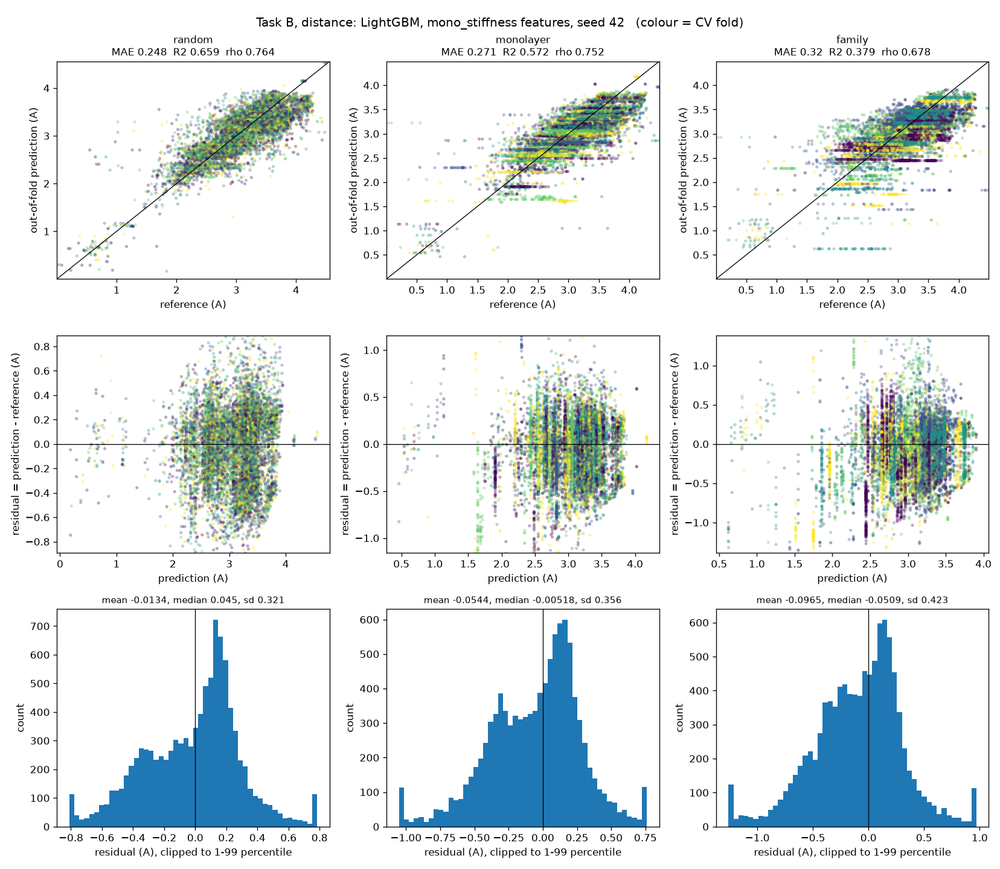
*Figure 10. Interlayer-gap parity and residuals.*

## 10. ML-potential validation
All thresholds were fixed in writing before the corresponding results existed (`mat-ml/results/mlip/*preregistration.md`); failures are reported as failures.

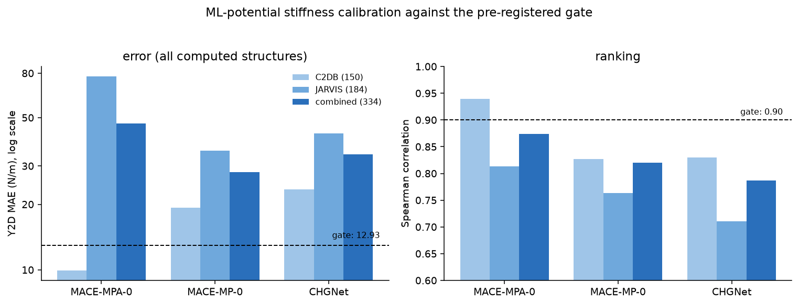
*Figure 11. Pre-registered stiffness gate (dashed lines: Spearman ≥ 0.9 and MAE ≤ 12.93 N/m, all computed structures). Only MACE-MPA-0 on C2DB passes.*

| Result | Outcome |
|---|---|
| Stiffness gate, MACE-MPA-0 | **C2DB (150) pass** (Spearman 0.939, MAE 9.9 N/m); JARVIS (184) fail (MAE 77.5, driven by a few unstable-tensor outliers); combined (334) **fail** (Spearman 0.874, MAE 47.1) |
| MACE-MP-0, CHGNet | fail everywhere; 30–45% too soft (median ratio 0.69 and 0.54) |
| Geometry diagnostic (fixed C2DB cell, 150 structures) | **No detectable geometry contribution**: MAE 9.91 → 9.42 N/m, f_geom = 0.050, 95% CI [−0.093, 0.176] (includes zero); the ~11% softening is unchanged |
| Interlayer, JARVIS-referenced (D3 on, 37 vdW-regime materials) | median ratio 1.09 (pass); within ±30% 46% (fail, needed 70%); failures 16% (fail, needed ≤ 10%) |
| Dispersion off | binding collapses (median ratio 0.15): D3 supplies a median 19 meV/Ų |
| **BiDB gate (307 bilayers)** | **D1 gap failed** (median error 0.175 Å, p90 0.479 Å; needed ≤ 0.10 and ≤ 0.30) · **E1 pass** (Spearman 0.903) · **E2 pass** (median ratio 1.097; 72.6% within ±30%; 98.4% within ×2) · **E3 pass** (0.7% failures) · **S1 pass** (within-monolayer Spearman 0.749; best stacking in the top 2 for 70%) |
| Bilayer / monolayer in-plane stiffness | **consistent with additive in-plane stiffness (median R 2.008, CI [1.95, 2.03]) in this model, small strains, 60 bilayers, not DFT-validated**; spread across stackings about 4 N/m |

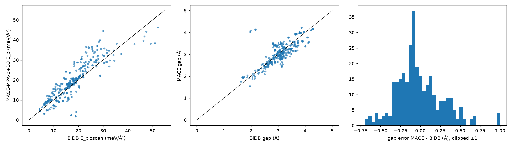
*Figure 12. MACE-MPA-0 + D3 against BiDB: binding energy (left), interlayer gap (middle), gap error (right).*

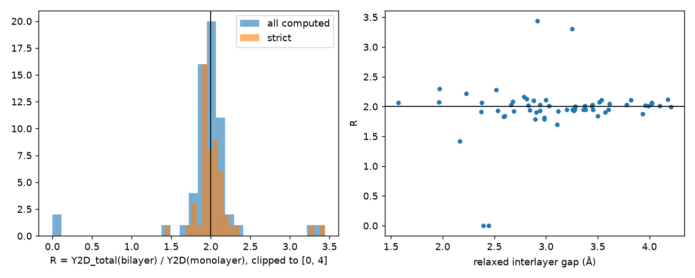
*Figure 13. Bilayer/monolayer stiffness ratio R (left; the line marks 2) and its relation to the relaxed gap (right).*

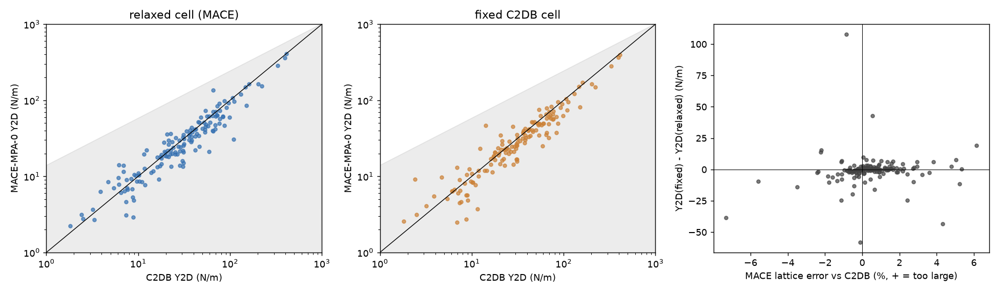
*Figure 14. Fixed-cell diagnostic: Y2D with the MACE-relaxed cell (left) and the C2DB cell (middle); change in Y2D against the lattice error (right).*

Full record: [`mlip_calibration.md`](mat-ml/docs/mlip_calibration.md). Bugs found and fixed along the way (MACE stress with non-periodic cells, tilted-cell rejections, CHGNet float32 noise in my own self-check) are listed there.

## 11. Limitations and what is not established
- One training database and one external set (186 JARVIS materials); labels for Task B come from one DFT workflow (PBE-D3, rigid layers, homobilayers only); the uid map is verified at formula level only.
- No hyper-parameter tuning, tabular models only, no separate held-out test set; seed and fold standard deviations do not include the uncertainty from the finite number of materials.
- **Not established:** DFT-validated bilayer stiffness; behaviour for magnetic, metallic or strongly bonded layers; whether a graph neural network would narrow the family gap; the meaning of BiDB's `binding_energy_gs`.

## 12. Reproduce
```
cd mat-ml
pip install -r requirements.txt
python -m pytest tests -q            # 13 fast tests
python -m src.train --task A         # Task A grid (~17 min)
python -m src.train --task B         # Task B (~1 h)
python -m src.diagnostics            # parity / residual plots + reproduction check
python -m src.make_figures           # the summary figures in this README
python -m src.save_models            # final models + model cards
```
Every number above comes from files in [`mat-ml/results/`](mat-ml/results/) (`headline_metrics.md` has MAE, RMSE, R², ln R² for every configuration). The ML-potential work needs a separate GPU environment (see `mlip_calibration.md`).

## 13. Data sources and licence
| Dataset | Used for | Source |
|---|---|---|
| C2DB | main training data | <https://c2db.fysik.dtu.dk/> |
| JARVIS-DFT 2D | external check; potential references | <https://jarvis-tools.readthedocs.io/en/master/databases.html> (`get_jarvis_2d.py`) |
| BiDB | Task B labels; interlayer validation | <https://2dhub.org/bidb/bidb.html>; Pakdel et al., Nat. Commun. 15, 932 (2024) |

`Dataset/` is deliberately not tracked (the C2DB tree is about 2.3 GB); see `mat-ml/data/README.md`. Released under the MIT License (see [`LICENSE.MD`](LICENSE.MD)).
